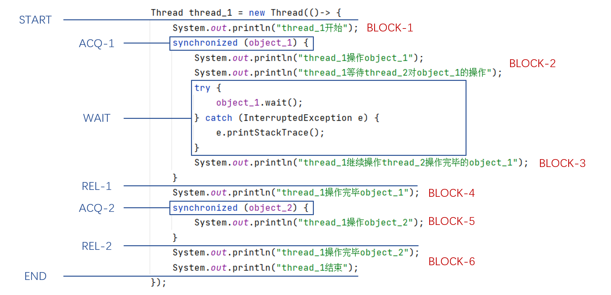

# **CodeTranscenders源码转换器**

## **摘要**

本项目旨在开发从Java到ArkTS的代码翻译工具，以解决Java并发代码转换为语义等价ArkTS代码的问题。现阶段已设计并实现简单的翻译工具demo，其支持对简单的基于共享内存模型的Java代码进行分析抽象出中间状态，并通过对中间状态的处理，完成后续直接对中间状态进行翻译，从而输出基于消息传递并发模型的ArkTS代码。此翻译工具关注的重心在于两种不同并发机制之间的转换，特别是对包含synchronized关键字、wait() & notify()方法等涉及并发逻辑的程序进行转换。此外，为实现上述转换，我们还提出了一个可以刻画不同并发机制的程序中间状态用于指导翻译实践。翻译工具的正确性已在实际开发环境中进行了验证。

## **1.软件分类**

代码迁移与转换工具

## **2.应用领域**

本翻译工具专注于将现有代码库从一种编程语言迁移到另一种，以适应新的技术要求或提高性能。本项目的翻译器能够处理Java并发代码，将其转换为使用ArkTS语言编程的语义等价的代码。未来可以将本工具应用于安卓应用到鸿蒙应用的转换和迁移。

## **3.开放源码组织认可的开放源码许可证类型等软件基本信息**

本项目采用 Apache License 2.0 许可证发布。有关更多许可信息，请参阅 [LICENSE](http://www.apache.org/licenses/LICENSE-2.0)。

本项目使用 Eclipse JDT，该项目根据 Eclipse Public License v1.0 (EPL-1.0) 许可。更多关于 JDT 的许可信息，可以访问 Eclipse 官方网站。

## **4.作品概述**

### **4.1作品特点和设计思路**

#### **作品特点**

1. 本翻译器聚焦于设计并实现并发机制之间的通用转换模式，而不聚焦于繁复琐碎的细节代码的翻译（这部分可以交由现有翻译工具（如JSweet）处理）；

2. 本翻译器注重Java代码到ArkTS代码过程中的中间状态的提炼与抽象表示，此中间状态：

   1. 既能表征Java子线程的并发逻辑，又能反映ArkTS程序的并发实现方法；

   2. 描述了**通用的调度线程**需要完成的工作内容以及实现方法；

   3. 无论是对后续程序自动翻译或者手动翻译都具有指导意义。

3. 本翻译器已在抖音并行软件开发场景中进行了正确性验证，支持对Java源码进行中间状态提取，并翻译成语义等价的消息传递并发实现。

#### **设计思路**

为解决题目要求的翻译任务，我们认为问题的解决可以分为下面三步进行：

1. 第一步关注如何对Java程序进行分块以形成包含程序动作和语句块的**中间状态**。这里的中间状态是先行设计的，故划分是有针对性的。

2. 第二步关注如何对**中间状态**进行分析处理，使其在符合Java并发语义的同时，又能以消息传递的视角去解释和处理。

3. 第三步关注如何对处理后的**中间状态**进行翻译。由于在上两个步骤中我们已经获取了充足的信息，故可以直接将中间状态翻译为消息传递机制中的消息处理函数（messageHandler）

综合以上三步，我们认为中间状态的抽象提炼很有必要，应设计出**既能表征Java程序的并发逻辑，又能反映ArkTS程序的并发实现**的中间状态。为此，我们从最简单的Java并发逻辑单元（涉及synchronized关键字）的程序出发，抽象出Java程序的中间状态骨架，并为其增加消息传递机制的必要信息，逐步形成并发子线程的中间状态图。

<center></center>

<center><b>图1 简单Java并发代码示例</b></center>

<center></center>

<center><b>图2 不同语言视角下的程序逻辑</b></center>

<center></center>

<center><b>图3 简单示例下的中间状态示意图</b></center>

按照上述规则，我们也可以对其他并发机制（wait()方法、notify()方法等）进行抽象，并形成类似的包含**程序动作、代码块、控制信号**的中间状态。

在这之后，我们认为控制信号的接受与发出可以通过实现一个**独立且通用的调度线程**来实现。为此，我们设计了通用的调度线程模式。该模式使用队列来模拟锁以及wait()条件的等待过程，并响应来自子线程的信号，通过在合适的时机发送匹配的信号来保证转换后程序具有正确且一致的并发行为。

最后，我们可以以中间状态为中心组织整个翻译过程。首先使用 Eclipse JDT（Java Development Tools） 来获取 AST，并借助AST按照一定的分块规则整理出Java中间状态骨架。之后我们对中间状态骨架进行处理，包含对代码块的预翻译（借助JSweet工具）和添加必要的控制信息。最后，我们从经过处理的中间状态出发，编码实现了完全解耦的调度线程与各并行子线程的翻译（子线程独立翻译产生、调度线程通过通用模式产生）。最终完成了整体的翻译模型，经测试转换后的代码与源程序具有一致的行为。

<center></center>

<center><b>图4 翻译程序设计图</b></center>

### **4.2功能描述**

由4.1节翻译程序设计图，翻译过程将经三个阶段组织。而在实际编码开发中我们将中间状态的处理和翻译整合为一个模块，因而程序功能模块主体分为两大部分：中间状态的生成和基于中间状态的ArtTS代码生成。我们将在4.2节简述转换器的两大功能，并在4.3节功能模块设计中详细讨论其设计与实现。

#### **中间状态图生成**

转换器具备中间状态图生成功能，可以将输入的Java源码转化为包含**程序动作**和**语句块**的中间状态图，从而更好地表征子线程的执行逻辑。如针对图5中Java源码示例，相较复杂的Thread_1和Thread_2的中间状态图如图6和图7所示：

<center></center>

<center><b>图5 典型Java并发程序</b></center>

<center></center>

<center><b>图6 Thread_1的中间状态图</b></center>

<center></center>

<center><b>图7 Thread_2的中间状态图</b></center>

#### **基于中间状态生成并发ArkTS代码**

转换器具备ArkTS代码生成功能，将待转换的Java多线程代码转换为基于中间状态图生成的并发ArkTS代码。如前图5所示Java源码示例，转换器将生成4个文件（index.ets, worker_1.ts, worker_2.ts，worker_3.ts）分别对应外部调度线程、Thread_1、Thread_2和Thread_3。调度线程通过与子线程通信来控制子线程的执行流程，子线程受调度线程控制在正确的时机执行各自的代码。

### **4.3功能模块设计**

接上节，翻译器程序主要分为两个功能模块，第一个模块负责对Java代码进行解析，得到能刻画两种并发模型的中间状态；第二个模块负责中间状态进行翻译，生成并发语义等价的ArkTS代码。

<center></center>

<center><b>图8 功能流程图</b></center>

#### **Java代码解析**

为了构造中间状态，我们根据Java代码的AST（抽象语法树）对代码进行解析，获取了Java代码中包含的并发信息。我们使用了Eclipse JDT（Java Development Tools）来获取AST，它表示了 Java 代码的语法结构，包括类、方法、变量、表达式等元素，并提供了访问和操作这些语法元素的接口。

以图9所示Thread_1为例详细说明中间状态的产生过程：

<center></center>

<center><b>图9 Java代码分块图</b></center>

对于Thread_1来说，线程启动后会经历锁的释放、获取，wait()方法等待等一系列程序动作，在这些程序动作之间会执行一系列与并发逻辑无关的代码块。我们在中间状态中用蓝色块表示**程序动作**（蓝色虚线框块为不会导致线程中断的程序动作，我们称之为**弱动作**，与其相反的称为**强动作**），并用红色块来表示与并发逻辑无关的**代码块**。继而我们得到了仅由红蓝结构块组成的Java程序中间状态骨架（如图10）。

<center></center>

<center><b>图10 Thread_1的Java程序骨架</b></center>

针对Java中间状态骨架，我们希望为其增加一组外部信号，使其可以用消息传递的并发机制去解释和理解。为使每一个语句块都能在合适的时机执行，我们为强动作后的代码块都添加了入口信号，弱动作后的代码块不需要处理（因为程序会不中断地继续执行弱动作后的语句块）。进一步，为了使子线程的外部能够感知到子线程的行为从而进行调度和调控，我们为每一个程序动作都绑定了发出信号。在中间状态图中，**外部控制信号**由橙色块表示，**发出信号**由绿色块表示（如图11）。

<center></center>

<center><b>图11 子线程中间状态图</b></center>

#### **ArkTS代码生成**

获取了输入代码对应的中间状态后，我们需要将中间状态翻译为ArkTS代码。对于不涉及并发操作的代码块，我们使用了JSweet来进行转换，得到了相应的TypeScript代码。因为ArkTS语言是TS语言的超集，故TS代码可直接在ArkTS环境中执行。对于涉及并发操作的程序动作，由于我们已经按照一定规则为中间状态赋予了外部信号，故我们只需要关注信号的入口和出口，可以观察得出**从外部信号开始，到下一个强动作的发出信号时结束**即是子线程在接受信号时需要表现的程序行为。我们进一步将子线程中间状态划分为图12所示的四块响应动作，由此来指导ArkTS - worker并发机制中messageHandler的翻译，最终翻译结果如图13所示。

<center></center>

<center><b>图12 划分后的子线程中间状态图</b></center>

<center></center>

<center><b>图13 翻译后的worker_1中的消息处理函数</b></center>

至此，子线程的翻译基本完成，为了保证转换后的代码若与源码并发语义等价，则需要由处理调度信号接收与发出的“外部”采取合适的机制去调度和控制。在我们的设计中，一个独立且通用的调度线程可以充当“外部”的职能。通过在合适的时机发送匹配的信号来保证转换后程序具有正确且一致的行为。

为保证临界资源的互斥访问，调度线程为每一把锁都创建了一个循环队列。对于需要临界资源（申请锁）的线程而言，都将会被加入到队列中。但同一时刻只有队首的线程在执行。调度线程在收到来自子线程的请求锁信号和释放锁信号时，会按照图14所示逻辑对锁队列进行操作。由于同步信号（SYS）发出的条件只有两种：锁未被持有或者收到了另一线程的锁释放信号。而只有收到了同步信号的线程才能发出锁释放信号。上述两点保证了临界资源的互斥访问。

<center></center>

<center><b>图14 调度线程对子线程事件的处理</b></center>

我们对Java中wait()与notify()方法也针对设计了类似的机制，由调度线程维护一个wait等待队列，只有在调度线程收到子线程notify条件时，才会按照一定规则将wait队列中的线程加入对应锁的等待队列等待调度。

需要指出的是，调度线程对各子线程而言是完全透明的，其只需要针对不同的子线程信号进行统一的处理即可。因此，翻译器将根据锁的数量直接按照上述规则生成统一且通用的调度线程，核心的消息处理函数如图15和图16所示。

<center></center>

<center><b>图15 调度线程中的消息处理函数（锁）</b></center>

<center></center>

<center><b>图16 调度线程中的消息处理函数（wait & notify）</b></center>

至此，转换器完成了ArkTS代码的生成任务，翻译后的代码包含相互透明的调度线程（Index.ets）和各子线程（worker_n.ts），他们按照中间状态指出的协议进行通信，协作完成并发任务。转换后程序的正确性以及转换器可用性验证将在4.5节给出。

### **4.4体系结构和关键技术点**

#### **体系结构**

<center></center>

<center><b>图17 体系结构图</b></center>

程序首先会根据中间状态的设计规则将Java多线程源码进行分块（利用Eclipse JDT提供的AST生成工具），切分后的代码块和程序动作经处理后可以形成代码翻译的中间状态图。进一步程序将针对中间状态进行解析和翻译，对于中间状态中的非并发代码块，可以利用JSweet工具直接进行翻译；对于并发逻辑则依赖对处理后中间状态中的信号信息进行翻译，形成独立通用的调度线程和各个子线程（均使用ArkTS语言中的worker并发机制）。

#### **关键技术点**

1. 中间状态生成：在对Java代码解析后得到由一系列语句块和程序动作组成的程序运行骨架，中间状态就是通过对程序骨架按照一定逻辑添加外部输入信号和发出信号而形成的。具体而言，我们根据是否会导致线程中断将程序动作划分为强动作和弱动作，每一个程序动作都会对应一个发出信号，且强动作之后代码块的执行依赖于一个入口信号，而弱动作之后的代码块可以接续弱动作信号发出后自然执行。例如，子线程中间状态中的第一个语句块在调度线程启动线程时才会执行，所以此语句块是一个强动作（START）之后的代码块，需要外部信号输入才能执行。synchronized语句块同理，当子线程执行遇到synchronized语句时需要进行获取锁的动作，这对应一个强动作的发出信号；而synchronized-body内的语句执行又依赖一个入口信号，因为之前的获取锁动作已经导致了子线程运行中断。而对于锁释放、notify动作而言，其不会导致线程中断，故被判定为弱动作，弱动作之后的代码块可以接续弱动作信号发出后自然执行。

2. 使用队列维护各线程之间的调度：为了保证临界资源的互斥访问，对于每一把锁，我们都会维护一个队列。调度线程会将申请锁的线程加入到队列中，每次只有队首的线程持有这把锁，当队首线程释放这把锁之后，调度线程将其从队首弹出并使下一个队首线程获得这把锁。在wait与notify的处理过程中，我们同样采取队列的方式来刻画wait方法调用后的等待，只有调度线程受到notify信号时，才会将wait队列中的队首线程弹出并按照一定规则加入锁队列等待调度。

### **4.5验收标准**

我们调研了实际开发中场景中常见的并发代码，选取了最常见的5种进行验证。

#### **Test1**

```java
package testfile;

public class SyncTest1 { 
    private static final Object lock = new Object();

    public static void main(String[] args) {
        Thread thread1 = new Thread(() -> {
            synchronized (lock) {
                System.out.println("thread1");
                try {
                    lock.wait(8000L);
                } catch (Exception e) {
                    // ignore
                }
                System.out.println("thread2");
            }
        });

        Thread thread2 = new Thread(() -> {
            synchronized (lock) {
                System.out.println("thread3");
                lock.notify();
                System.out.println("thread4");
            }
        });

        thread1.start();
        thread2.start();
    }
}
```

可以正确转换为语义相同的ArkTS代码

#### **Test2**

```java
package testfile;

public class SyncTest2 {

    private static final Object lock = new Object();

    public static void main(String[] args) {
        Thread thread1 = new Thread(() -> {
            synchronized (lock) {
                System.out.println("thread1");
                try {
                    lock.wait(8000L);
                } catch (Exception e) {
                    // ignore
                }
                System.out.println("thread2");
            }
        });

        Thread thread2 = new Thread(() -> {
            synchronized (lock) {
                System.out.println("thread3");
                lock.notify();
                System.out.println("thread4");
            }
        });

        thread2.start();
        thread1.start();
    }
}
```

可以正确转换为语义相同的ArkTS代码

注：以上两个样例会有两种运行结果，但SyncTest1中case1出现的概率高，SyncTest2中case2出现的概率高；生成的ArkTS代码也会有两种运行结果，但是两种情况出现概率与Java不同（Java与ArkTS底层逻辑问题）

#### **Test3**

```java
package testfile;

import java.util.LinkedList;

public class MultipleThread {

    private static final LinkedList<String> urls = new LinkedList<>();

    public static void main(String[] args) {

        Thread thread1 = new Thread(() -> {
            synchronized(urls) {
                System.out.println("add1");
            }
        });
        Thread thread2 = new Thread(() -> {
            synchronized(urls) {
                System.out.println("add2");   
            }
        });
        Thread thread3 = new Thread(() -> {
            synchronized(urls) {
                System.out.println("add3");
            }
        });
        Thread thread4 = new Thread(() -> {
            synchronized(urls) {
                System.out.println("remove");
            }
        });

        thread1.start();
        thread2.start();
        thread3.start();
        thread4.start();
    }
}
```

可以正确转换为语义相同的ArkTS代码

#### **Test4**

```java
package testfile;

public class AdvancedWaitNotifyTest {
    private static boolean condition = false;
    private static final Object lock = new Object();

    public static void main(String[] args) {
        Thread waitingThread = new Thread(() -> {
            synchronized (lock) {
                System.out.println("Waiting Thread: Waiting for condition to become true.");
                while (!condition) {
                    try {
                        lock.wait();
                    } catch (Exception e) { 

                     }
                }
                System.out.println("Waiting Thread: Condition met, continuing execution.");
            }
        });

        Thread notifyingThread = new Thread(() -> {
            synchronized (lock) {
                condition = true;
                System.out.println("Notifying Thread: Condition set to true, notifying waiting thread.");
                lock.notify();
            }
        });

        waitingThread.start();
        notifyingThread.start();
    }
}
```

不能转换为语义相同的ArkTS代码

原因：无法处理循环中的wait方法

#### **总结**

 ● 翻译器能够完成对不包含复杂控制流和数据依赖的Java并发代码的正确翻译

 ● 翻译器现阶段还无法处理循环中的wait等方法，需要后续对中间状态加入控制流来实现